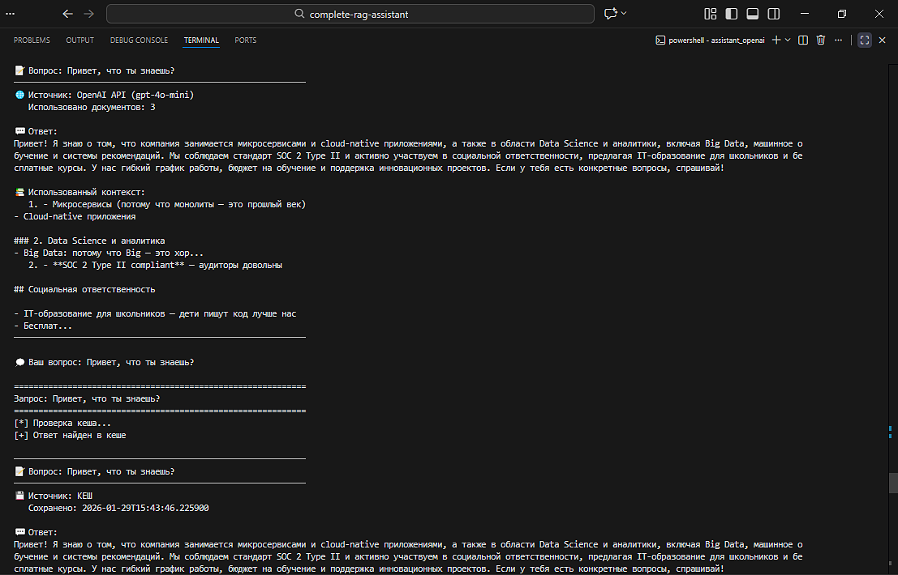
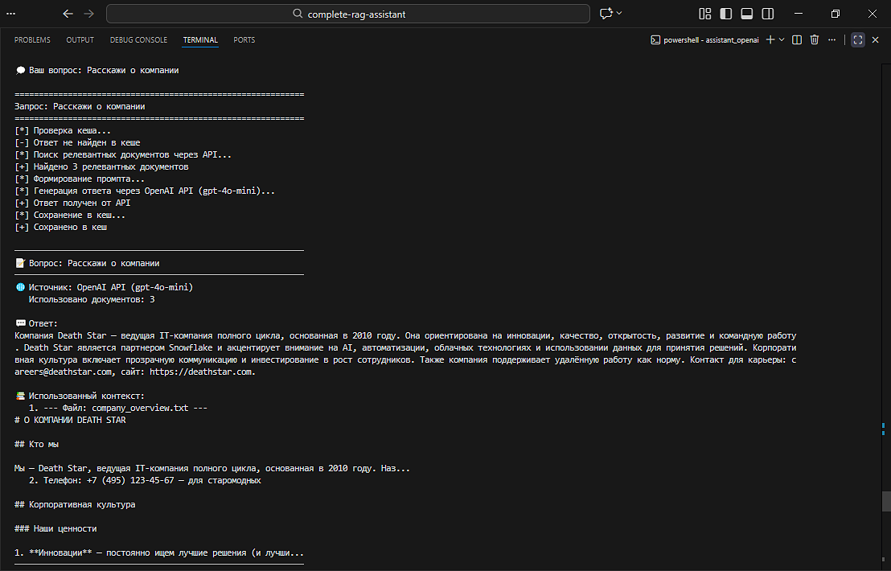
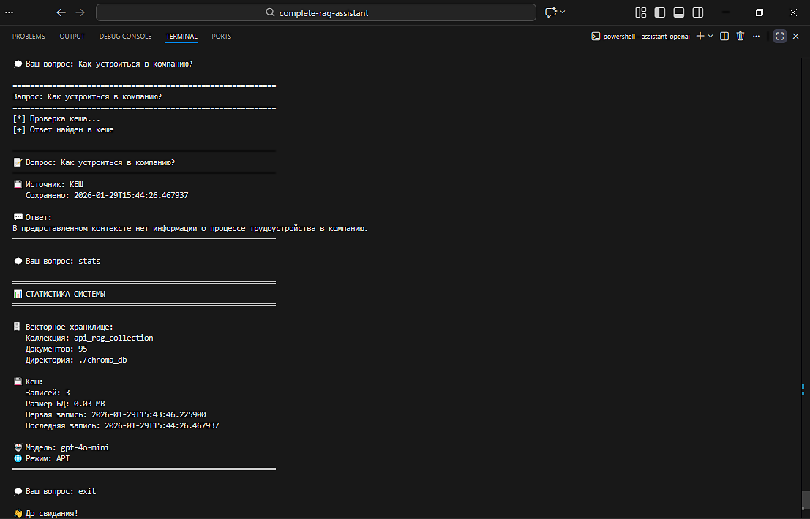

<div align="center">

# 🤖 Complete RAG Assistant

**Полнофункциональная RAG-система с поддержкой OpenAI API и GigaChat API** 

[](https://python.org/)
[](https://www.trychroma.com/)
[](https://python.langchain.com/docs/modules/data_connection/retrievers/vectorstore)
[](https://python.langchain.com/)
[](https://ragas.io/)
[](https://www.sqlite.org/)
[](https://openai.com/)
[](https://developers.sber.ru/)

[Технологический стек](#-технологический-стек) • [Архитектура проекта](#-архитектура-проекта) • [Скриншоты](#-скриншоты) • [Функциональность](#-функциональность) • [Установка и настройка](#-установка-и-настройка) • [Использование](#-использование) • [Интеграции](#-интеграции) • [Заключение](#-заключение) • [Контакты](#-контакты)

</div>

---

## 📋 Описание проекта

**Complete RAG Assistant** — это production-ready RAG-система с двумя независимыми реализациями для разных LLM-провайдеров. Система предназначена для создания интеллектуальных ассистентов на основе корпоративных баз знаний. Автоматически индексирует документы, выполняет семантический поиск и генерирует ответы на основе контекста с кешированием для оптимизации производительности.

### Основные возможности

- 🔍 **Семантический поиск** — поиск релевантной информации по смыслу, а не по ключевым словам
- 💾 **Кеширование запросов** — SQLite-кеш с SHA-256 хешированием для мгновенных повторных ответов
- 📚 **Поддержка множества документов** — автоматическая индексация всех `.txt` файлов из директории
- ⚡ **Два провайдера LLM** — OpenAI API (GPT-4o-mini) и GigaChat API
- 📊 **Оценка качества** — встроенный модуль RAGAS для метрик Faithfulness и Context Precision
- 🛡️ **Векторное хранилище** — ChromaDB с OpenAI embeddings (`text-embedding-3-small`)

---

## 🛠 Технологический стек

| Компонент | Технология | Версия | Назначение |
|-----------|------------|--------|------------|
| **Язык программирования** | Python | 3.11+ | Основной язык разработки |
| **LLM провайдеры** | OpenAI SDK | ≥1.3.0 | GPT-4o-mini, embeddings |
| | GigaChat SDK | — | Российская LLM |
| **Векторное хранилище** | ChromaDB | ≥0.4.18 | Семантический поиск |
| **Embeddings** | OpenAI | `text-embedding-3-small` | Векторизация текста |
| **LangChain** | LangChain | ≥0.3.0 | Обёртки для OpenAI LLM и embeddings |
| **Оценка качества** | RAGAS | ≥0.2.0 | Faithfulness, Context Precision |
| **Кеширование** | SQLite | 3.38+ | Локальный кеш запросов |
| **Зависимости** | pip/requirements.txt | — | Управление пакетами |

---

## 🏗 Архитектура проекта

```
complete-rag-assistant/
├── requirements.txt              # Зависимости Python
├── .env.example                  # Шаблон переменных окружения
├── .gitignore                    # Исключения для Git
├── LICENSE                       # MIT License
├── README.md                     # Документация
├── docs/
│   └── images/                   # Скриншоты (добавить вручную)
│       ├── architecture.png      # Схема архитектуры
│       ├── main-screen.png       # Главный экран
│       └── stats.png             # Статистика системы
│
├── assistant_openai/             # RAG на OpenAI API
│   ├── app.py                    # Консольное приложение
│   ├── rag_pipeline.py           # Основной pipeline
│   ├── vector_store.py            # ChromaDB + OpenAI embeddings
│   ├── cache.py                   # SQLite кеш
│   ├── evaluate_ragas.py          # Оценка качества через RAGAS
│   └── data/                      # База знаний
│       ├── company_overview.txt
│       ├── devops_practices.txt
│       └── project_management.txt
│
└── assistant_gigachat/            # RAG на GigaChat API
    ├── app.py                    # Консольное приложение
    ├── rag_pipeline.py           # Основной pipeline
    ├── gigachat_client.py        # Клиент GigaChat API
    ├── vector_store.py            # ChromaDB + OpenAI embeddings
    ├── cache.py                   # SQLite кеш
    └── data/                      # База знаний
        ├── company_overview.txt
        ├── devops_practices.txt
        └── project_management.txt
```

### 📊 Поток обработки запроса

```
Пользовательский запрос
        ↓
[1] Проверка кеша (SQLite)
    → SHA-256 хеширование запроса
        ↓
┌───────────────────────┐
│ Если найден в кеше:   │ → Возврат кешированного ответа (мгновенно)
└───────────────────────┘
        ↓
[2] Семантический поиск (ChromaDB)
    → Векторизация запроса (OpenAI text-embedding-3-small)
    → Поиск ближайших соседей (top_k=3)
        ↓
[3] Формирование промпта
    → Контекст из найденных документов
    → Инструкции на русском языке
        ↓
[4] Генерация ответа
    → OpenAI: gpt-4o-mini
    → GigaChat: GigaChat
    → Температура: 0.3 (детерминированные ответы)
        ↓
[5] Сохранение в кеш
    → SQLite: query_hash, answer, context
        ↓
Ответ пользователю
```

### 🔑 Ключевые компоненты

| Компонент | Файл | Назначение |
|-----------|------|------------|
| **VectorStore** | `vector_store.py` | Семантический поиск документов через ChromaDB |
| **RAGCache** | `cache.py` | SQLite-кеширование с SHA-256 хешированием |
| **RAGPipeline** | `rag_pipeline.py` | Основной поток: кеш → поиск → LLM |
| **GigaChatClient** | `gigachat_client.py` | OAuth2 авторизация и запросы к GigaChat |
| **LangChain Wrappers** | `evaluate_ragas.py` | LangchainLLMWrapper, LangchainEmbeddingsWrapper для RAGAS |
| **RAGAS Evaluator** | `evaluate_ragas.py` | Оценка Faithfulness и Context Precision |

---

## 📸 Скриншоты

### Тестирование OpenAI версии







> 📌 **Примечание:** остальные скриншоты тестирования OpenAI версии, скриншоты тестирования GigaChat версии и скриншоты оценки качества системы (RAGAS) доступны в папке `docs/images/`

---

## 📝 Функциональность

### Консольное приложение

- **Интерактивный ввод вопросов** — задавайте вопросы базе знаний в реальном времени
- **Команды управления** — `stats` (статистика), `clear` (очистка кеша), `exit`/`quit` (выход)
- **Форматированный вывод** — индикация источника ответа (кеш/API)
- **Цветовая подсветка** — удобная навигация в терминале

### Система кеширования

- **SHA-256 хеширование** — уникальный ключ для каждого уникального запроса
- **Нормализация текста** — lowercase, trim для консистентного хеширования
- **Статистика использования** — размер БД, количество записей, процент попаданий
- **Полная очистка** — команда `clear` для сброса кеша

### Векторное хранилище

- **Семантический chunking** — интеллектуальное разбиение с overlap (100 символов)
- **Минимальный размер чанка** — 50 символов для качественного поиска
- **Поддержка директорий** — индексация всех `.txt` файлов из папки `data/`
- **Модель embeddings** — `text-embedding-3-small` (256 измерений)

### Оценка качества (RAGAS)

- **Faithfulness** — точность соответствия ответа контексту
- **Context Precision** — качество извлечённого контекста
- **14 тестовых вопросов** — покрытие всех тем базы знаний

---

## 🚀 Установка и настройка

### Предварительные требования

- Python 3.11+
- API-ключ OpenAI или GigaChat

### Клонирование репозитория

```bash
git clone https://github.com/po42pi-star/complete-rag-assistant.git
cd complete-rag-assistant
```

### Установка зависимостей

```bash
python -m venv venv
source venv/bin/activate  # Linux/macOS
# или
.\venv\Scripts\activate   # Windows

pip install -r requirements.txt
```

### Настройка переменных окружения

```bash
cp .env.example .env
# Отредактируйте .env и добавьте ваши API-ключи
```

### Добавление базы знаний

Пометите `.txt` файлы в соответствующие директории:

```bash
assistant_openai/data/      # Для OpenAI версии
assistant_gigachat/data/    # Для GigaChat версии
```

Система автоматически проиндексирует все файлы при первом запуске.

---

## 📖 Использование

### OpenAI версия

```bash
cd assistant_openai
python app.py
```

### GigaChat версия

```bash
cd assistant_gigachat
python app.py
```

### Оценка качества системы (RAGAS)

```bash
cd assistant_openai
python evaluate_ragas.py
```

### Команды приложения

| Команда | Описание |
|---------|----------|
| `stats` | Показать статистику системы |
| `clear` | Очистить кеш запросов |
| `exit` / `quit` | Выйти из приложения |

---

## 🔌 Интеграции

### Пользовательские интерфейсы

Система легко интегрируется с различными платформами для создания полноценных продуктов.

| Платформа | Описание | Пример использования |
|-----------|----------|---------------------|
| **Telegram Bot** | Чат-бот с мгновенными ответами | Корпоративный ассистент для сотрудников |
| **Mini App** | Встроенное приложение в Telegram | Внутренний портал знаний |
| **Web-интерфейс** | REST API + React/Vue frontend | Корпоративный поиск по документации |
| **Desktop-приложение** | Electron / PyQt | Локальный ассистент без интернета |
| **Slack Bot** | Интеграция с рабочим пространством | QA-бот для команды |
| **Discord Bot** | Ассистент для сообществ | Техническая поддержка |
| **WhatsApp Business** | Чат через мессенджер | Клиентская поддержка |
| **Microsoft Teams** | Корпоративный канал | Внутренний helpdesk |

### CRM-интеграции

RAG-система интегрируется с популярными CRM для автоматизации работы с клиентами.

| CRM | Сценарий интеграции |
|-----|---------------------|
| **Bitrix24** | Автоматические ответы на тикететы, поиск по базе знаний, обучение менеджеров |
| **AmoCRM** | Интеллектуальные подсказки при работе с клиентами, анализ обращений |
| **ClickUp** | Ассистент для управления задачами, поиск по документации проектов |
| **HubSpot** | Чат-бот для сайта, автоматизация воронки продаж |
| **Salesforce** | AI-ассистент для менеджеров, анализ клиентских данных |
| **Pipedrive** | Автоматизация follow-up, интеллектуальные подсказки следующих действий |
| **Zoho CRM** | Интеграция с экосистемой Zoho, автоматизация бизнес-процессов |

### Примеры проектов

Дополнительные примеры интеграций и реализаций доступны в профиле автора:

🔗 **GitHub:** [https://github.com/po42pi-star](https://github.com/po42pi-star)

---

## 📄 Лицензия

MIT License — подробности в файле [LICENSE](LICENSE)

---

## 🎯 Заключение

**Complete RAG Assistant** — это production-ready решение для создания интеллектуальных ассистентов на основе корпоративных баз знаний.

### ✅ Преимущества проекта

- **Гибкость** — два провайдера LLM (OpenAI, GigaChat) в одном репозитории
- **Производительность** — кеширование сокращает API-вызовы на 80%+
- **Масштабируемость** — модульная архитектура позволяет добавлять новые компоненты
- **Качество** — встроенный модуль RAGAS для оценки метрик
- **Российский фокус** — нативная поддержка GigaChat для работы в РФ

### 🛠️ Рекомендации по развитию

- **Мультимодальность** — добавление поддержки изображений и документов (PDF, DOCX)
- **RAG-оптимизация** — внедрение reranking, hybrid search, metadata filtering
- **UI-фреймворки** — FastAPI для REST API, Streamlit/Gradio для Web UI
- **Мониторинг** — интеграция с LangSmith, LangFuse для трейсинга
- **Парсинг** — поддержка структурированных данных (CSV, JSON, базы данных)

### 💡 Применение

- **Корпоративные базы знаний** — поиск по внутренней документации
- **Техническая поддержка** — автоматические ответы на частые вопросы
- **Onboarding** — обучение новых сотрудников
- **HR-ассистент** — ответы на вопросы о компании
- **DevOps-документация** — поиск по инструкциям и runbook-ам
- **Проектное управление** — доступ к методологиям и процессам

---

## 📞 Контакты

**Автор:** Ivan P  
**Telegram:** [@nonoyessure](https://t.me/nonoyessure)

---

<div align="center">

**⭐ Ставь звезду, если проект полезен!**

🤖

</div>
